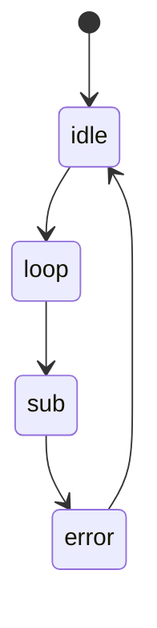

# FreeRTOS and State pattern

A minimal example of the [State pattern](https://en.wikipedia.org/wiki/State_pattern)
implemented in C, running as a FreeRTOS task on a Raspberry Pi Pico 2
(RP2350).

## How it works

- **`State`** ([include/state.h](include/state.h), [src/state.c](src/state.c)) is a
  single function pointer, `run_state`. It is the common shape every
  concrete state shares.
- **`Context`** ([include/context.h](include/context.h), [src/context.c](src/context.c))
  owns one `State` instance per concrete state (`idle`, `loop`, `sub`,
  `error`) by value, plus a `current_state` pointer selecting the active
  one. No dynamic allocation anywhere: building a `Context` reserves all
  the storage the state machine will ever need in one block.
- **Transitions** go through `SetState(ctx, id)`, which repoints
  `current_state` at the matching field inside the same `Context`.
- **`SubState`** (in `context.h`) shows how to extend `State` with extra
  per-state data: it embeds a `State` as its first field (`super`) plus
  one more field (`value`). Because `super` sits at offset 0 in memory,
  a `SubState` can be handed around as a plain `State*` (upcast, just
  `&sub.super`) and safely cast back to `SubState*` when the concrete
  state needs its own fields (downcast, in `SubState_Run`) — the classic
  C idiom for single-field polymorphism, no `malloc` or vtable involved.

Current chain of states, looping forever: `idle → loop → sub → error → idle → ...`



**[src/state.c](src/state.c) is placeholder logic**, not a real state
machine: each `*_Run()` just prints and calls `SetState()` to move to
the next one, purely to show the pattern's own mechanism (`self`/
`context`, and how a transition works). It's the starting point for
building an actual state machine on top of it - `context->peripheral`
(see below) is already wired up and ready to use once you replace
these bodies with real logic.

`RunCurrentState()` runs as a FreeRTOS task (`xTaskCreate` in
[src/main.c](src/main.c)): it starts at `idle` and loops forever, calling
`current_state->run_state()` and then `vTaskDelay()` between iterations
so it yields to the scheduler instead of busy-waiting.

## Project layout

```
include/          Public headers (context.h, state.h)
src/               Sources (main.c, context.c, state.c) + CMakeLists.txt
port/FreeRTOS-Kernel/  FreeRTOSConfig.h and the CMake glue to build the kernel
FreeRTOS_Kernel_import.cmake  Pico-side FreeRTOS kernel import (SMP port)
CMakeLists.txt     Top-level build: picks the board, pulls in the Pico SDK
                   and FreeRTOS kernel, adds src/
```

## Requirements

- `arm-none-eabi-gcc` toolchain and CMake ≥ 3.12
- [pico-sdk](https://github.com/raspberrypi/pico-sdk), with `PICO_SDK_PATH`
  pointing at it
- [FreeRTOS-Kernel](https://github.com/FreeRTOS/FreeRTOS-Kernel), with
  `PICO_FREERTOS` pointing at it (used as `FREERTOS_KERNEL_PATH`)

Target board is set in [CMakeLists.txt](CMakeLists.txt): `PICO_BOARD=pico2`,
`PICO_PLATFORM=rp2350`.

## Building

```bash
export PICO_SDK_PATH=/path/to/pico-sdk
export PICO_FREERTOS=/path/to/FreeRTOS-Kernel

cmake -S . -B build
cmake --build build
```

The build produces `build/src/FreeRTOSC.uf2`: hold BOOTSEL on the Pico,
plug it in, and copy the `.uf2` file to the mass-storage device that
appears.

## Output

Connect over USB serial (`stdio_init_all()` in `main.c` enables both USB
and UART stdio) to see each state's `printf` as the machine walks its
states, one every 100ms.
